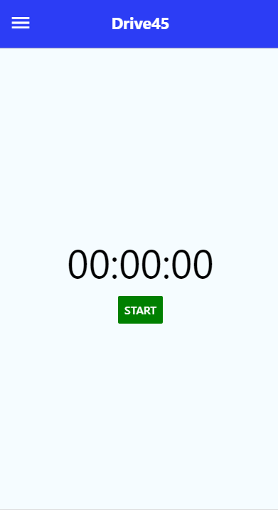
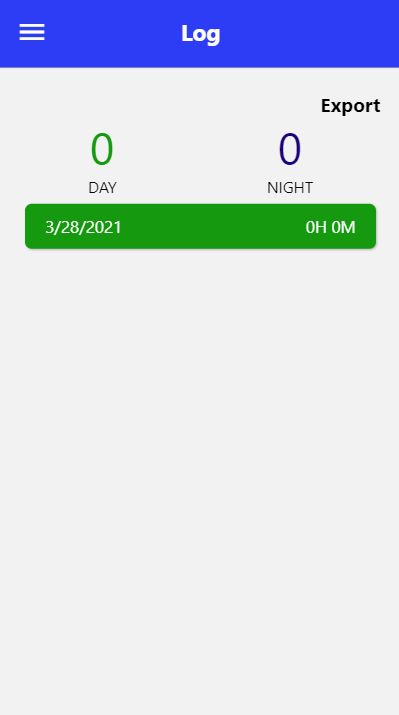

# Drive 45 App

This was an mobile app that I created along with Jesse Bullard for Deep Run's Driver's Education course. The app allows students to log their driving times and export the time via email. The app was created using React Native, a Javascript framework for creating mobile apps and Expo, a platform for creating Android and iOS apps. The app can be downloaded onto an Android device through an apk file, or used online as a Progressive Web App.

[Drive 45 App](https://driversed2024.github.io/)

**Features**

Home Screen
* Contains a stopwatch that starts counting up from 0
* Can start or pause the stopwatch
* Button to save the time of the stopwatch

Log Screen
* Lists the saved times with the date and the time saved
* Each time saved is in its own card
* Green background if saved during the day
* Blue background if saved during the night
* Counter displaying the total number of hours driven during the day and night respectively
* Export Button - will send a copy of the times to the student and parent email as stated in the settings

Settings Screen
* Fields for Student and Parent Email
* Save button to store the emails for exporting

**Email API**
* Used to send an email with the logged time to the student and parent email
* Created using Flask and HTML
* App will send an API call to this with the student email, parent email, and logged time

**Warnings**
* Can only view the log screen after a time has been saved
* Export will not work without student and parent email filled out

